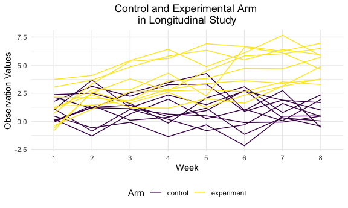

Homework 5
================
Philip Kim
11/16/2021

-   [Problem 1](#problem-1)
    -   [Single city/Baltimore, MD](#single-citybaltimore-md)
    -   [Function](#function)
    -   [Iteration across cities](#iteration-across-cities)
    -   [Plot with estimate/CI](#plot-with-estimateci)
-   [Problem 2](#problem-2)
    -   [Function](#function-1)
    -   [Iterate/read in data and create new
        variable](#iterateread-in-data-and-create-new-variable)
    -   [Tidy data](#tidy-data)
    -   [Spaghetti Plot](#spaghetti-plot)
    -   [Comments on Differences](#comments-on-differences)
-   [Problem 3](#problem-3)

# Problem 1

``` r
homicide_df = 
  read_csv("./data/homicide-data.csv", na = c("", "Unknown")) %>% 
  mutate(
    city_state = str_c(city, state),
    resolution = case_when(
      disposition == "Closed without arrest" ~ "unsolved",
      disposition == "Open/No arrest" ~ "unsolved",
      disposition == "Closed by arrest" ~ "solved")
    ) %>% 
  relocate(city_state) %>% 
  filter(city_state != "TulsaAL")
```

## Single city/Baltimore, MD

``` r
baltimore_df = 
  homicide_df %>% 
  filter(city_state == "BaltimoreMD")

baltimore_summary = 
  baltimore_df %>% 
  summarize(
    unsolved = sum(resolution == "unsolved"),
    n = n())

baltimore_test =
  prop.test(
  x = baltimore_summary %>% pull(unsolved),
  n = baltimore_summary %>% pull(n))

baltimore_test %>% 
  broom::tidy()
```

    ## # A tibble: 1 × 8
    ##   estimate statistic  p.value parameter conf.low conf.high method    alternative
    ##      <dbl>     <dbl>    <dbl>     <int>    <dbl>     <dbl> <chr>     <chr>      
    ## 1    0.646      239. 6.46e-54         1    0.628     0.663 1-sample… two.sided

## Function

``` r
prop_test_function = function(city_df) {
  city_summary = 
    city_df %>% 
   summarize(
    unsolved = sum(resolution == "unsolved"),
    n = n())

city_test =
  prop.test(
  x = city_summary %>% pull(unsolved),
  n = city_summary %>% pull(n))

  return(city_test)
}

prop_test_function(baltimore_df)
```

    ## 
    ##  1-sample proportions test with continuity correction
    ## 
    ## data:  city_summary %>% pull(unsolved) out of city_summary %>% pull(n), null probability 0.5
    ## X-squared = 239.01, df = 1, p-value < 2.2e-16
    ## alternative hypothesis: true p is not equal to 0.5
    ## 95 percent confidence interval:
    ##  0.6275625 0.6631599
    ## sample estimates:
    ##         p 
    ## 0.6455607

``` r
homicide_df %>% 
  filter(city_state == "AlbuquerqueNM") %>% 
  prop_test_function()
```

    ## 
    ##  1-sample proportions test with continuity correction
    ## 
    ## data:  city_summary %>% pull(unsolved) out of city_summary %>% pull(n), null probability 0.5
    ## X-squared = 19.114, df = 1, p-value = 1.232e-05
    ## alternative hypothesis: true p is not equal to 0.5
    ## 95 percent confidence interval:
    ##  0.3372604 0.4375766
    ## sample estimates:
    ##         p 
    ## 0.3862434

## Iteration across cities

``` r
results_df = 
  homicide_df %>% 
  nest(data = uid:resolution) %>% 
  mutate(
    test_results = map(data, prop_test_function),
    tidy_results = map(test_results, broom::tidy)
  ) %>% 
  select(city_state, tidy_results) %>% 
  unnest(tidy_results) %>% 
  select(city_state, estimate, starts_with("conf"))
```

## Plot with estimate/CI

``` r
results_df %>% 
  mutate(city_state = fct_reorder(city_state, estimate)) %>% 
  ggplot(aes(x = city_state, y = estimate)) +
  geom_point() +
  geom_errorbar(aes(ymin = conf.low, ymax = conf.high)) +
  theme(axis.text.x = element_text(angle = 90, vjust = 0.5, hjust = 1))
```


# Problem 2

``` r
files = list.files("./data/zip_data/")
```

## Function

``` r
read_files_function = function(x) {
  
  path = str_c("./data/zip_data/", x)
  
  y = read_csv(path)
  
  return(y)
}
```

## Iterate/read in data and create new variable

``` r
study_df = 
  tibble(
    files = list.files("./data/zip_data/")) %>% 
  mutate(
    data = map(files, read_files_function))
```

## Tidy data

``` r
tidy_study_df = 
  study_df %>% 
  separate(files, into = c("arm", "subject_id"), sep = "_") %>% 
    mutate(
      subject_id = str_remove(subject_id, ".csv"),
      arm = ifelse(arm == "con", "control", "experiment"),
      subject_id = as.numeric(subject_id),
      subject_id = ifelse(arm == "experiment", subject_id + 10, subject_id + 0),
      subject_id = as.factor(subject_id)) %>% 
  unnest(data) %>% 
  pivot_longer(
    week_1:week_8,
    names_to = "week",
    names_prefix = "week_",
    values_to = "observation") %>% 
  mutate(
    week = as.factor(week))
```

## Spaghetti Plot

``` r
tidy_study_df %>% 
  ggplot(aes(x = week, y = observation, color = arm)) + 
  geom_line(aes(group = subject_id)) +
  labs(
    x = "Week",
    y = "Observation Values",
    color = "Arm",
    title = "Control and Experimental Arm \nin Longitudinal Study") +
   theme(plot.title = element_text(hjust = 0.5))
```



## Comments on Differences

# Problem 3

``` r
set.seed(10)

iris_with_missing = iris %>% 
  map_df(~replace(.x, sample(1:150, 20), NA)) %>%
  mutate(Species = as.character(Species))
```

Write a function.

``` r
fill_in_missing = function(vector) {
  
  if (is.numeric) {
    ...
  }
  
  if (is.character) {
    ...
  }
  
  
}
```
